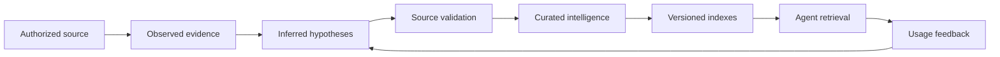

# Executive Overview

## Problem

Agents often receive either too little context—a raw schema or a folder of documents—or too much context—entire catalogs and large data samples. Neither is sufficient for reliable data intelligence. Raw structure does not explain business meaning, joins, grain, quality, freshness, or what questions are answerable. Large dumps exceed model budgets, expose sensitive values, and still provide no proof that inferred relationships are real.

The desired system accepts an authorized source and produces an agent-ready intelligence layer that answers six questions:

1. **What exists?** Assets, fields, paths, types, variants, contracts, content units, and versions.
2. **What does it look like?** Size, cardinality, missingness, distribution, formats, temporal shape, and anomalies.
3. **What does it mean?** Roles, purposes, domains, entities, events, measures, processes, policies, and vocabulary.
4. **How is it connected?** Identities, grain, references, joins, lineage, citations, state transitions, graph paths, and co-usage.
5. **Can it be trusted and used?** Validation status, confidence, coverage, quality, freshness, policy, cost, and counter-evidence.
6. **How should an agent consume it?** Ranked retrieval, compact manifests, capabilities, query guidance, warnings, and evidence citations.

## Product Thesis

The profiler is an **evidence-maturation platform**, not a schema scraper and not an unconstrained model prompt.

The system is intentionally generous in producing hypotheses and conservative in promoting facts. It keeps weak signals because they may guide discovery, but it prevents weak signals from entering query-ready sections until they are validated.

## Business Outcomes

### Faster source onboarding

A source owner registers a source descriptor rather than hand-authoring field documentation, join maps, query examples, and agent prompts. The system builds an initial profile automatically and gives the owner explicit gaps to review.

### Safer agent reasoning

Agents receive validated identities and relationships, grain and fan-out warnings, data freshness and quality, semantic aliases, policy tags, and evidence references. Unsupported capabilities are withheld rather than guessed.

### Better discovery

Hybrid indexing lets an agent find assets by exact names, business language, graph neighborhood, time, type, policy, and observed usage. The profiler exposes both likely matches and important counter-evidence.

### Reusable organizational knowledge

Repeated successful analyses, reviewed semantics, query patterns, and corrected relationships become versioned evidence. They improve later retrieval without silently changing historical manifests.

### Measurable improvement

Every tuning change is assessed against a fixed corpus. Precision, recall, coverage, calibration, latency, bytes read, and model use are visible, preventing a speed improvement from hiding correctness loss.

## Universal Source Model

The common pipeline works with abstract assets, fields, observations, and relationships. Source adapters map native constructs into this model.

| Source kind | Asset | Field/content unit | Relationship examples |
|---|---|---|---|
| Relational | Table or view | Column | Key reference, derivation, co-usage |
| Tabular file | File-table or partition | Column | Shared key, partition relation |
| Semi-structured | Record collection | Nested path or variant | Reference path, containment |
| Document corpus | Document | Section, chunk, claim, mention | Citation, entity mention, similarity |
| API | Operation | Parameter or response path | Contract reference, pagination, endpoint dependency |
| Stream | Event type | Field, partition, transition | Correlation, sequence, temporal alignment |
| Graph | Node or edge type | Property | Native edge, path, containment |
| Multimodal | Media asset | Segment, frame, region, transcript | Temporal alignment, cross-modal similarity |

## Essential Boundaries

### Control plane vs data plane

The control plane registers sources, policies, runs, leases, checkpoints, versions, and manifests. The data plane reads source metadata and bounded samples through typed connector operations. Source content never controls the control plane.

### Evidence store vs projections

The evidence store is append-only and preserves contradictions. Manifests and indexes are rebuildable, immutable projections over a source version and policy version.

### Hypothesis vs query-ready relationship

A name match, embedding similarity, scenario requirement, or generated suggestion is a hypothesis. A query-ready relationship requires an authoritative contract or source-appropriate validation with non-zero support, bilateral coverage, normalization, and a sample receipt.

### Semantic model vs business truth

Generated domains, entities, metrics, and scenarios are candidate business knowledge. Curation and repeated successful use can increase maturity. Generated confidence alone cannot make them authoritative.

## Success Definition

A profiling run is successful only when:

- The source and policy versions are pinned.
- Every required stage has a terminal status.
- Expected, attempted, completed, failed, skipped, and unavailable counts reconcile.
- No required gate reports zero work.
- Every approximate claim has a sample receipt.
- Every query-ready relationship has supporting validation.
- Every manifest section reports coverage and omitted content.
- Sensitive raw values are absent from manifests and prompts unless explicitly approved.
- The manifest and indexes can be rebuilt from evidence.
- Agent retrieval returns evidence references and caveats.

## Delivery Shape

The recommended product is a small set of stable contracts around replaceable modules:

- Connector software development kit.
- Run orchestrator and durable work queue.
- Structural and statistical profilers.
- Semantic workers and deterministic fallbacks.
- Identity, grain, relationship, and quality validators.
- Evidence ledger and projection builders.
- Lexical, vector, graph, temporal, and faceted indexes.
- Agent retrieval interface.
- Review and feedback interface.
- Evaluation and mutation harness.

This package defines those contracts and behaviors without prescribing a programming language, storage engine, model provider, or deployment platform.
