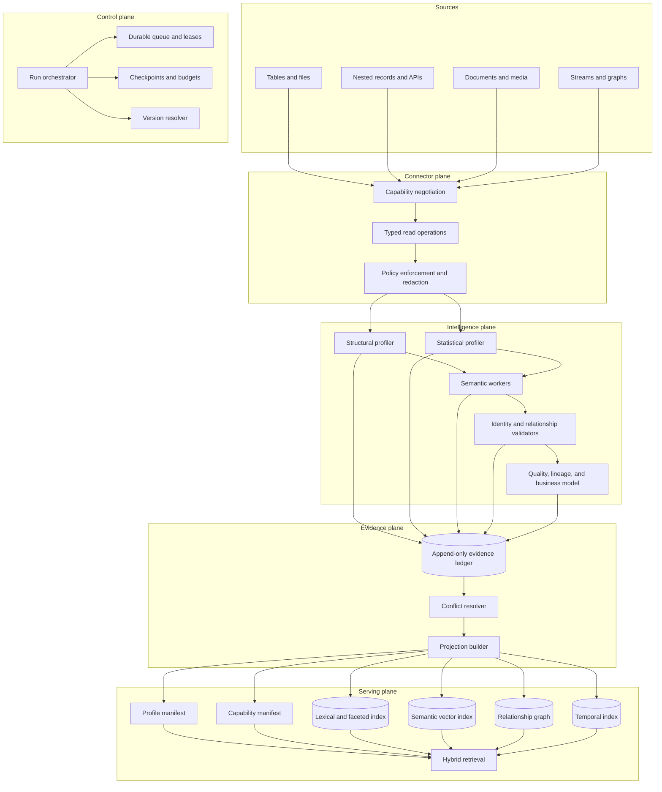
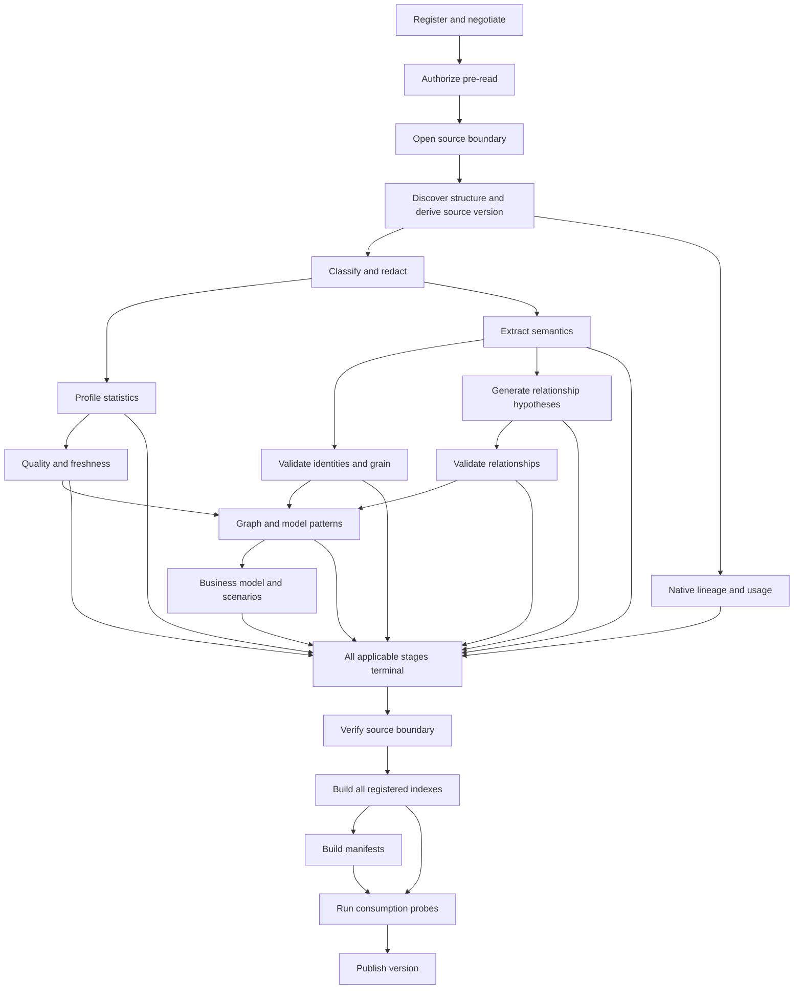

# Reference Architecture

## Architectural Style

Use ports and adapters around an append-only evidence core. Source-specific code is confined to connectors and validators. Semantic models, storage engines, indexes, schedulers, and user interfaces are replaceable.



## Components

### Source Registry
Stores connector-neutral source descriptors, authorization scope, opaque credential-registry identifiers, policy reference, negotiated capabilities, immutable connector implementation version, and a canonical capability-manifest hash. Before persistence it scans every caller-controlled string for secrets, resolves the credential identifier in a trusted registry, and canonicalizes a connector-native relative locator against a registered endpoint. Absolute authorities, traversal, encoded separators, IP literals, and redirect escapes are rejected before network access. It never stores credentials or raw connection strings.

### Connector SDK

Every connector implements a typed subset of these operations:

| Operation | Contract |
|---|---|
| `Describe()` | Connector kind, version, limitations, and capability list |
| `EnumerateAssets(cursor)` | Stable asset descriptors and continuation token |
| `ReadStructure(asset, cursor)` | Fields, paths, types, constraints, and native version |
| `EstimatePopulation(asset)` | Approximate size with source and confidence |
| `Sample(asset, plan)` | Deterministic bounded sample with receipt |
| `Aggregate(asset, aggregatePlan)` | Allowlisted source-side statistics |
| `ReadLineage(asset)` | Native dependencies and transformations when available |
| `ReadUsage(window)` | Privacy-filtered usage history when available |
| `ReadChanges(cursor)` | Structural or content changes for incremental profiling |
| `ResolveReference(reference)` | Source-native reference resolution |

Operations accept typed plans, not free-form query text. A source-specific connector may compile the plan into its native query language behind the boundary.

### Policy Gateway

The gateway enforces:

- Caller entitlement and source scope.
- Operation allowlist.
- Read-only policy.
- Asset and field exclusions.
- Byte, row, object, time, and concurrency budgets.
- Sensitive-content detection and redaction.
- Minimum group size.
- Content-is-data isolation.
- Audit and trace context.

The gateway runs before semantic workers and before derived indexes.

### Run Orchestrator

The orchestrator executes a dependency graph, not a single monolithic job. It persists a run record before work starts. Each stage claims durable work with a lease and fencing token, checkpoints at the configured unit, and writes terminal counts.

Run state:

```text
pending -> running -> completed
                   -> completed-partial
                   -> failed
                   -> cancelled
```

Terminal runs never return to running. A retry or reprofile creates a new run linked to the predecessor.

Before any source metadata or value-shape read, the orchestrator opens a source consistency boundary from a snapshot, transaction, opening watermark, offset range, ETag set, or explicit before-marker. Discovery reads only through that boundary and derives the final structural source version. After every evidence-producing stage terminates, the orchestrator closes or verifies the boundary before index construction. Evidence from incompatible boundaries cannot be published as one coherent source version. An expired boundary forces a new run rather than a misleading resume.

Stage dependencies are terminal-state dependencies: an applicable dependency must finish, while an explicitly unavailable or not-applicable optional dependency permits downstream partial output with reduced coverage. Manifest construction is a barrier after every applicable profiling stage reaches a terminal state. A coherent current publication additionally requires every required stage to complete with nonzero work and a consistent source boundary. Run accounting reconciles expected work to completed, failed, skipped, unavailable, not-run, and deferred work; attempted work reconciles to completed plus failed work. Every terminal stage emits one signed typed receipt with the full run-stable coordinate, dependency-receipt IDs, exact work counts, and content hashes for resolvable output artifacts. The sum of output item counts equals completed work.

### Durable Work Queue

The queue stores source version, policy hash, stage, asset, attempt, priority, estimated cost, evidence dependencies, and deduplication key. In-memory queues are acceptable only for disposable local execution and cannot support a production completion claim.

### Profiling Workers

Workers are stateless and idempotent. They consume work records, use connector operations, and write evidence. Worker families include:

- Structural harvesters.
- Statistical profilers.
- Nested-schema and variant profilers.
- Document and media segmenters.
- Semantic extractors.
- Identity and grain validators.
- Relationship candidate generators and validators.
- Quality and anomaly workers.
- Lineage and usage analyzers.
- Business-model synthesizers.

### Evidence Ledger

The ledger stores immutable evidence records keyed by evidence ID. Stable logical keys support latest-current projections, but records are never overwritten. Contradictions and rejections are first-class.

Logical keys are structured coordinates, not caller-composed path strings. Every key includes authorization scope, source ID and structural version, subject kind and ID, predicate, method version, and policy hash before canonical hashing. Evidence also pins connector ID, implementation version, and capability hash. Kind-specific coordinates extend that base:

- Structural field: source + source version + asset + path + structural predicate.
- Field profile: source + source version + asset + path + statistic + sample-plan hash.
- Identity: source + source version + asset + normalized scope/local/version paths.
- Relationship: source-version pair + normalized endpoints + validator version.
- Business concept: source + source version + concept kind + normalized name + source evidence set.

### Projection Builder

Builds immutable profile and capability manifests and versioned index records from evidence. Structural `sourceVersion` is independent from `manifestVersion`. The immutable projection coordinate also pins connector ID/version/capability hash, authorization scope, policy hash, taxonomy/pipeline/method versions, evidence-ledger cutoff, and revocation epoch; a connector implementation, relationship, semantic, method, taxonomy, or policy change creates a new manifest version without pretending source structure changed. Projection code applies:

- Current-version selection.
- Maturity and policy filters.
- Conflict handling.
- Stable deduplication.
- Confidence calibration.
- Section caps and diversity.
- Coverage accounting.
- Redaction.

If an input layer is missing, the manifest says so. It does not fill the gap with generic prose.

### Index Suite

One index cannot serve all agent needs.

| Index | Best for | Required metadata |
|---|---|---|
| Lexical | Exact asset, field, enum, glossary, and error terms | Source version, policy tags, evidence refs |
| Semantic | Business questions, aliases, similar concepts, document chunks | Embedding model/version, source version, evidence refs |
| Graph | Join paths, lineage, citations, entities, process flows | Edge maturity, confidence, direction, cost, evidence refs |
| Temporal | Freshness, schema drift, time coverage, event transitions | Validity intervals and observed time |
| Faceted | Source kind, domain, role, quality, policy, maturity | Normalized taxonomy IDs |

Indexes are derived artifacts. They are rebuildable, access controlled, version scoped, and deleted when their source entitlement is revoked.

### Hybrid Retrieval Service

Retrieval executes this order:

1. Resolve caller and authorized source scope.
2. Select only index namespaces authorized for that scope; unauthorized records never enter a candidate set or public count.
3. Pin the complete projection coordinate: source and manifest versions, connector implementation/capability hash, evidence cutoff, policy, taxonomy, pipeline, methods, and revocation epoch.
4. Classify retrieval purpose.
5. Generate lexical, semantic, graph, temporal, and facet candidates inside those authorized namespaces.
6. Apply remaining hard gates: projection version, policy, validity, revocation epoch, and maturity requirement.
7. Normalize component scores.
8. Rank with an explainable function.
9. Diversify across assets, domains, evidence kinds, and viewpoints.
10. Include counter-evidence and conflicts.
11. Compress to the token budget.
12. Return post-authorization coverage and evidence references.

Recommended score:

$$
S = 0.30E + 0.20R + 0.15U + 0.10F + 0.10Q + 0.10P - 0.05C
$$

where:

- $E$: evidence strength and maturity.
- $R$: semantic/lexical relevance.
- $U$: repeated successful usage.
- $F$: freshness.
- $Q$: data quality.
- $P$: relationship-path quality.
- $C$: estimated execution or context cost.

The exact weights are configuration and must be calibrated. Authorization and source version are never score terms; they are hard filters.

## Stage Dependency Graph



  The canonical IDs, dependencies, requiredness, capabilities, and receipts live in `pipeline/stages.json`. Documentation and implementations must derive stage lists from that artifact rather than maintaining independent counts.

Generated semantics may run in parallel by asset after classification through the opened source boundary; statistical evidence enriches but does not universally block it. Quality is conditional when statistical capabilities are unavailable. Native lineage and relationship validation can run independently after their prerequisites. Boundary verification waits for every applicable evidence-producing stage to terminate; index construction starts only after verification succeeds. Manifest construction records unavailable or failed optional stages, while current publication additionally requires every registry-declared index kind and applies the strict publication gate.

## Consistency and Concurrency

### Single source writer

Only one active profiling run may publish for a source. The lock key is `sourceId` alone. A stable registration-generation candidate is available when the lease is acquired, but the structural `sourceVersion` does not exist until bounded discovery at stage 4. The run records that final version under the held lease and proves its consistency at stage 15. Use a distributed lease with a fencing token; a `running` run must hold one, and a terminal run must have released it.

Every evidence write carries the writing run's `fencingToken`, so a worker whose lease expired is rejected at write time and the rejection is auditable. A rule that no written artifact carries is not enforceable.

### Exactly-once effect, not exactly-once delivery

Work delivery may be repeated. Evidence writes use deterministic deduplication keys and immutable IDs to produce an exactly-once logical effect.

### Projection publication

Build a projection under a new `projectionId`, build its indexes, assemble the manifests over those indexes, assign a new manifest ID and `manifestVersion`, compute `contentHash` as the cryptographic seal over each canonical manifest body, validate the complete immutable coordinate, atomically move the authorized current pointer, then make it discoverable. Explicit historical lookup always requires both source and manifest versions and never resolves through the current pointer. Never expose a partially assembled current manifest.

### Additive schema evolution

The ledger and projection stores must apply additive schema definitions even when a table or collection already exists. “Exists” does not mean “matches current contract.” Destructive recreate is not a migration strategy.

## Deployment Topology

The architecture supports a modular monolith initially and independent workers later. The boundaries should remain the same:

- API/control service.
- Orchestrator and durable queue.
- Worker pool.
- Evidence and run store.
- Projection/index builder.
- Retrieval service.
- Review interface.
- Telemetry pipeline.

Scaling is by work partition: source, source version, stage, asset, and relationship candidate. Relationship validation and model inference should have separate concurrency pools because their cost and failure modes differ.

## Extension Rules

A connector or profiler extension must:

1. Declare capabilities and unsupported operations.
2. Use typed plans and return receipts.
3. Emit the common evidence envelope.
4. Preserve source and policy version.
5. Apply redaction before external semantic processing.
6. Define source-specific validators.
7. Add positive, negative, unavailable, and adversarial BDD scenarios.
8. Add a benchmark slice.
9. Avoid weakening common maturity and query-ready gates.

A new **source kind** additionally adds a row to `pipeline/source-kind-profiles.json` declaring its required connector capabilities, stage buckets, consistency-boundary modes, validators, and positive/failure scenarios; the stage buckets are then derived from those capabilities rather than asserted.

A new **evidence kind** adds the kind to `taxonomies/evidence-kinds.yaml` and the evidence contract, and bumps the taxonomy minor version. Because the contracts accept any `1.x.y` taxonomy version, previously written records stay valid.

A new **index kind** adds a row to `pipeline/index-registry.json` declaring its required metadata and governed store, from which the index contract's kinds and the lifecycle receipt's store inventory are reconciled. An index whose metadata the contract does not require is rejected.

A new **connector-defined profile extension** registers an immutable JSON Schema ID, version, path, hash, and allowed source kinds in `config/extension-schema-registry.json`. The extension carries that schema coordinate, validates against the allowlisted schema, and signs a replay-resistant envelope covering extension identity, asset, connector identity, revocation epoch, payload/schema hashes, handling, and evidence references. A free-form object is not an extension contract.

## Read-Plan Result Boundary

The current reusable contract deliberately permits exactly one typed operation per read plan because `read-execution-result.schema.json` returns one bounded tabular result. Multi-operation or heterogeneous plans require an `operationResults` union keyed by stable operation ID, with per-operation outcome, cursor, truncation, and failed/not-run accounting. Until that contract exists, widening `operations.maxItems` would create unattributable results and is prohibited.
