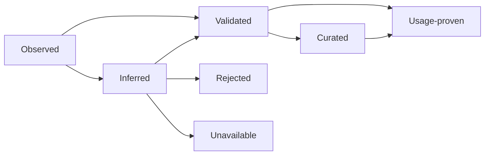
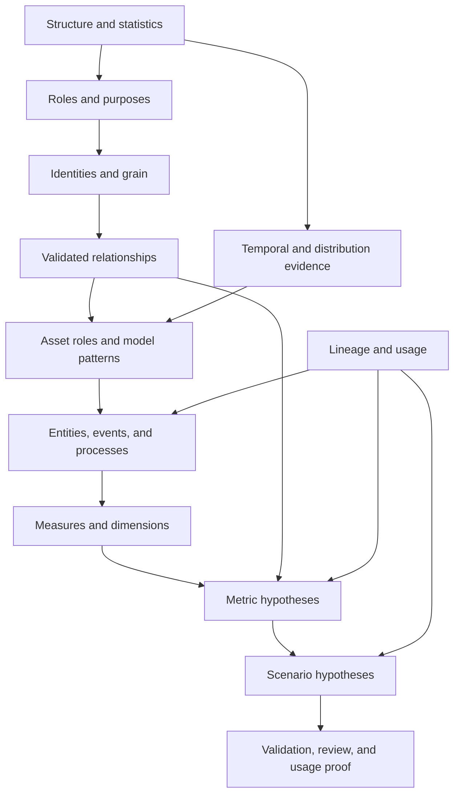

# Evidence and Business Model

## Evidence Is the Canonical Substrate

The evidence ledger is the only durable source of derived intelligence. Manifests, graphs, indexes, summaries, and prompts are projections. This makes every claim traceable and every projection rebuildable.

## Evidence Record

The canonical contract is `contracts/evidence-record.schema.json`. Its key concepts are:

| Field | Purpose |
|---|---|
| Subject | Stable asset and optional field/path under a pinned source version |
| Claim | Predicate, object, and optional unit |
| Kind | Structural, statistical, semantic, identity, relationship, quality, business, policy, or index evidence |
| Maturity | Observed, inferred, validated, curated, usage-proven, rejected, or unavailable |
| Outcome | Passed, failed, evaluated-empty, not-applicable, not-run, unavailable, blocked, or cancelled |
| Confidence | Calibrated probability-like score within an evidence class |
| Provenance | Producer, method, version, model/prompt hash, and input evidence |
| Sample | Population, actual work, method, exactness, seed, and error bound |
| Validity | Time and source-schema version under which the claim applies |
| Counter-evidence | Explicit contradictory evidence references |
| Policy tags | Access, privacy, retention, and handling constraints |

## Maturity State Machine



The diagram describes the maturity of a **stable logical key** in the current-view projection, not a transition applied to a stored record. Records are immutable: a later record supersedes an earlier one by naming it in `supersedesEvidenceIds`, and the projection derives which record is current. There is no `superseded` record state to write.

Retrieval's `minimumMaturity` filter uses the explicit `maturityRank` in `taxonomies/evidence-kinds.yaml`. Ranked states are `inferred` (1), `observed` (3), `validated` (4), `curated` (5), and `usage-proven` (6); `rejected` and `unavailable` are unranked and reachable only as counter-evidence. Directly measured facts therefore outrank generated hypotheses.

Not every kind follows every transition. A structural schema read can be observed directly. A generated purpose begins inferred. An empirical join becomes validated. A review promotes a claim to curated. Repeated successful use can make a capability usage-proven only when an independently signed, content-pinned usage-proof artifact and independently pinned issuer registry resolve through the runtime. Ordinary evidence records and self-reported counters cannot promote themselves. Rejection and unavailability remain searchable outcomes.

## Confidence Rules

1. Confidence is meaningful only with evidence kind, method, and maturity.
2. Confidence must be calibrated within evidence classes.
3. A deterministic source read may have confidence $1.0$ while still being stale.
4. A generated claim may have confidence $0.95$ while remaining inferred.
5. An unavailable validator does not convert prior hypothesis confidence into validation.
6. Conflicting evidence lowers projection confidence or creates a conflict; it is not averaged blindly.
7. A reviewed claim must record the policy and version reviewed.

## Stable Logical Keys

Use stable keys to assemble current views while retaining history.

Every key begins with `authorizationScopeId | sourceId | sourceVersion | subjectKind | subjectId | predicate | methodVersion | policyHash`. The evidence contract stores those coordinates as a typed object; implementations hash its RFC 8785 canonical representation for storage. The following kind-specific parts extend that base:

```text
field structure:
  assetId | fieldPath | structural predicate

field statistic:
  assetId | fieldPath | statistic | samplePlanHash

identity:
  assetId | sorted(scope) | ordered(localKey) | ordered(version)

relationship:
  sourceVersionPair | kind | normalized(leftEndpoint) | normalized(rightEndpoint) | validatorVersion

business concept:
  conceptKind | normalizedName | supportingEvidenceSetHash
```

The schema represents these as closed kind-specific coordinate objects rather than caller-composed strings. Sample-derived keys pin the canonical sample-plan hash; identity keys pin scope/local/version paths; relationship keys pin both normalized endpoints and validator version; business keys pin the supporting-evidence-set hash. Do not deduplicate unrelated assets merely because their field names or normalized join signatures match.

## Conflict Model

A conflict exists when current evidence makes incompatible claims about the same logical subject and predicate. The projection builder should:

1. Prefer authoritative and validated evidence over inference.
2. Prefer current source-version evidence over stale evidence.
3. Prefer curated evidence only when the curation policy covers the current version.
4. Preserve unresolved conflicts in manifests.
5. Withhold capabilities whose required claim remains materially conflicted.

## Business Model

The business model is a graph of evidence-backed concepts rather than a generated paragraph.

### Domain

A coherent business area containing related entities, events, processes, policies, measures, and vocabulary. Domain membership is inferred holistically across assets and may have alternatives. A single isolated asset should not force a new domain without evidence.

### Entity

A durable business thing with one or more identities. Required fields:

- Name and description.
- Source asset projections.
- Canonical entity identity.
- Alternate identities and aliases.
- Scope and ownership.
- Current-state and history representations.
- Quality/freshness posture.
- Supporting and counter-evidence.

The machine contract also records aliases, alternate identity evidence, ownership, current/history asset projections, and quality/freshness posture. Missing ownership remains `null`; it is not invented.

### Event

An occurrence at a time, usually associated with an entity or process. Required fields:

- Event name and timestamp semantics.
- Event identity or deduplication key.
- Subject entities.
- Actor and state transition when present.
- Late-arrival and ordering behavior.
- Source asset and grain.

The machine contract requires event identity paths, actor/state-transition paths (which may be empty when absent), late-arrival policy, ordering policy, and grain.

### Process

A sequence or graph of events and states that produces a business outcome. A process hypothesis should identify:

- Start and terminal events.
- State field or transition evidence.
- Participants and entities.
- Expected order and optional branches.
- Duration measures.
- Missing-stage and censoring conditions.

### Measure

A numeric or countable observation with unit, additivity, grain, and valid aggregation. A field being numeric is not sufficient.

Measure contract:

```text
name
business meaning
unit
source expression
grain
additivity: additive | semi-additive | non-additive
valid aggregation functions
filters and exclusions
null and error semantics
time semantics
evidence references
```

### Dimension

A categorical or hierarchical axis used to group or filter measures. It records cardinality, hierarchy, slowly-changing behavior, aliases, and valid values where the catalog is complete.

### Metric

A governed calculation over measures, dimensions, time, and filters.

Metric contract:

```text
business question
formula abstract syntax tree or typed expression
numerator and denominator
unit and scale
required source assets
required validated relationships
grain before and after aggregation
time window and timezone
filters, exclusions, and population
missing-data semantics
freshness and quality constraints
validation and usage status
```

Generated metric formulas remain hypotheses until parsed, type-checked, dry-run against the source, and compared with acceptance examples or reviewed definitions.

Metric, numerator, denominator, and measure expressions use a closed abstract syntax tree. Filters are typed path/operator/value records. Scale, population, pre/post-aggregation grain, time path/window/timezone, exclusions, freshness constraints, and quality constraints are explicit. Free-form calculation objects are invalid.

### Scenario

A scenario describes a decision or workflow supported by data:

- Decision or outcome.
- Stakeholders as generic roles.
- Questions.
- Required entities, events, measures, and dimensions.
- Required data paths.
- Coverage and freshness constraints.
- Candidate metrics.
- Confidence and evidence.

A scenario relationship answers “what must connect to answer this question,” not “what is proven to connect.” It enters relationship validation as a hypothesis.

### Glossary term

A term maps business language to one or more concepts, fields, enum values, or metrics. It stores synonyms, ambiguity, scope, examples, source, and maturity. Ambiguous terms should return alternatives, not one arbitrary mapping.

## Model Patterns

Storage, hierarchy, graph, dimensional, and temporal patterns are first-class projections with maturity, confidence, asset IDs, evidence references, alternatives, and conflicts. Asset roles, field semantic roles, and relationship kinds are closed against `taxonomies/semantic-roles.yaml`; informal unregistered strings cannot become serving metadata.

## Relationship Projection Binding

A validated served relationship is a projection of its cited relationship-validation evidence. The projection must match both endpoints, predicates, per-predicate normalization expressions, validation outcome/status, basis, exactness, plan hash, cardinality, bilateral coverage, matching-key count, confidence bound, overall confidence, validator method, and recommended operation. Citing genuine evidence while changing any decision-bearing join field is invalid.

## Derivation Pipeline



## Business Model Validation

| Concept | Validation |
|---|---|
| Entity | Identity viability, repeated representation reconciliation, reviewed definition |
| Event | Timestamp and grain validation, ordering/duplication profile |
| Process | Observed transition support and path coverage |
| Measure | Type, unit, grain, additivity, and aggregation tests |
| Dimension | Cardinality, catalog completeness, hierarchy consistency |
| Metric | Parse/type check, source dry-run, denominator guards, fixture outcomes |
| Scenario | Required capability and relationship closure |
| Glossary | Source references, ambiguity review, usage confirmation |

## Agent-Ready Profile Manifest

The profile manifest contains:

- Summary and pinned source version.
- Assets and fields with structural/statistical/semantic evidence.
- Identities and grain with validation status.
- Direct relationships and inferred paths separately.
- Quality, freshness, anomalies, and conflicts.
- Lineage and usage evidence.
- Business model.
- Index versions.
- Coverage receipt and evidence references.

It excludes raw sensitive samples, unsupported facts, unbounded query examples, and low-value duplicate evidence.

## Capability Manifest

The capability manifest is intentionally separate. It maps agent intents to safe analytical paths. A capability includes:

- Question patterns and aliases.
- Required assets.
- Required validated relationships.
- Metrics or transformations.
- Expected result shape.
- Constraints and warnings.
- Maturity and confidence.
- Evidence references.

The profile manifest explains the source. The capability manifest explains what an agent can safely do with it.

## Coverage Model

Coverage must be computed from explicit denominators. Suggested dimensions:

- Assets discovered / source-reported assets.
- Fields profiled / fields discovered.
- Fields semantically classified / eligible fields.
- Identity-eligible assets with evaluated identities / identity-eligible assets.
- Relationship candidates validated / candidates generated.
- Assets with at least one validated relationship / relationship-eligible assets.
- Quality dimensions evaluated / applicable dimensions.
- Business concepts with evidence / concepts emitted.
- Manifest sections present / applicable sections.

Do not count an unavailable or skipped item as completed. Do not quote a ratio without preserving the item inventory used to derive its denominator.
