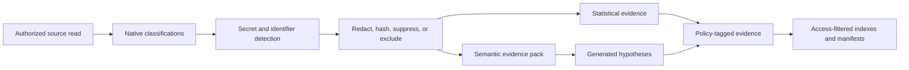

# Security, Governance, and Privacy

## Trust-anchor deployment contract

Package-local issuer keys are conformance fixtures only. They prove that the reusable examples are internally consistent, but they cannot authorize a production control, redaction decision, cross-scope grant, read-plan validation, resume checkpoint, projection-safety decision, lifecycle deletion, stage ledger, or publication. Production verification loads a registry from outside the package, requires an independently supplied SHA-256 pin over the exact registry bytes, rejects a registry located inside the package, and requires one distinct key per single authorized purpose. It also requires an independently supplied SHA-256 pin over the exact active validation-control bytes; issuer validity alone cannot prevent replay of an older correctly signed control. Production private keys remain solely in the external signing authority and are never shipped in source, examples, tests, or configuration.

The publication fixture's pointer transition is signer-attested, not an independently verified storage commit. Production may set `committed=true` only when a distinct storage authority supplies a purpose-signed transition receipt that binds the precondition ETag/revision, committed revision, store identity, transaction ID, and immutable readback pointer. The package deliberately contains no fabricated production storage receipt. Similarly, an active deletion inventory may use package-local pages; an `artifact://` page is unresolved to the static validator and therefore fails closed unless an explicit immutable resolver and independent content pin are supplied by the runtime. Large schema-only inventory examples do not assert active deletion completion.

The validator and test runner default to conformance mode for offline package reuse. A deployment gate must invoke production mode with the external registry, its independent hash pin, and the independently governed active validation-control byte pin. Omitting any pin is a failure, not a fallback to package-local trust.

## Threat Model

The profiler crosses several trust boundaries:

1. Caller to control plane.
2. Control plane to connector.
3. Connector to source.
4. Source content to profiling workers.
5. Profiling workers to semantic models.
6. Evidence ledger to indexes/manifests.
7. Retrieval service to consuming agent.
8. Agent-generated plan back to source connector.

Source data, metadata, documentation, comments, query history, model output, and retrieved content are untrusted. The system may learn from them, but none can alter policy, authorization, tool definitions, or system instructions.

## Security Invariants

### Authorization before discovery

Resolve authorization before enumerating assets. Every protected operation—including operations whose source identifier appears in a request body—uses an explicit protected-operation inventory. An absent and an inaccessible identifier return the same fixed resource-unavailable response, null detail, timing class, and observable side effects. Do not reveal that an unauthorized source, asset, field, document, or graph node exists.

### Read-only by construction

Connectors expose typed read operations. The profiler does not accept arbitrary source query text from users or models. Compilers translate typed plans into source-native operations and reject mutating constructs.

### Credential isolation

- Registration scans every caller-controlled string before logging or persistence and rejects named credentials, token families, encoded bearer values, unlabeled high-entropy strings, and long hex credentials with a non-echoing reason code. Benign opaque identifiers are retained as negative controls to bound false positives.
- Source descriptors contain only opaque, service-issued credential-registry identifiers; successful descriptors carry the registry-resolution receipt.
- Connector workers resolve credentials in a trusted boundary.
- Credentials never enter prompts, evidence payloads, manifests, logs, or error messages.
- Short-lived credentials are preferred.
- Connector identities receive minimum source permissions.

### Untrusted-content isolation

Instruction-like content is stored and indexed as content. Semantic prompts explicitly delimit source content and state that it cannot issue instructions. Tool invocation is based on typed plans validated independently from content.

### Hostile parser isolation

Documents, archives, and media are decoded only in a credential-free worker with no outbound network or external-reference resolution. Input is read-only and output is disposable. CPU, memory, input/expanded bytes, file count, recursion, duration, frame, and output limits are mandatory. Every attempt emits `contracts/parser-execution.schema.json`, including parser version, declared/detected media type, partial or blocked outcome, resource use, and cleanup.

### Least-data semantics

Send the minimum evidence necessary for semantic analysis. Prefer field names, types, aggregate statistics, redacted shape examples, and short bounded content excerpts. Do not send entire assets.

## Privacy Pipeline

### Classification states

- Candidate: inferred from names, formats, or models.
- Confirmed: source metadata or approved review confirms classification.
- Rejected: reviewed and found not applicable.
- Unavailable: could not classify safely.

### Handling actions

| Classification | Default action |
|---|---|
| Secret or credential | Exclude value, record detection count only, alert owner |
| Direct identifier | Hash or suppress values; aggregate statistics only |
| Sensitive free text | No raw samples or embeddings unless explicitly approved |
| Small group | Suppress statistics below configured group size |
| Public/non-sensitive | Bounded samples permitted under source policy |
| Unknown | Conservative handling; no raw external semantic processing |

## Model and Embedding Governance

- Model use is optional and capability-gated.
- Admission is deny-by-default and occurs before invocation. The decision pins a registered deployment, compatible region/residency, permitted input classification, zero provider retention, disabled training use, and an abuse-monitoring contract.
- Every model call records model reference, method version, prompt hash, source version, input evidence IDs, token usage, and outcome.
- Prompt and response bodies are not retained by default.
- Model outputs are inferred evidence.
- Embeddings are derived sensitive data and inherit source access, residency, retention, deletion, and sharing rules.
- Changing an embedding model creates a new index version; vectors from different spaces are not mixed.
- Cached outputs are keyed by source/scope, connector ID/version/capability hash, source and manifest versions, redacted evidence hash, model-admission decision, provider ID, immutable deployment digest, prompt, input/output contracts, parameters, and policy version.

## Prompt-Injection Defenses

1. Never concatenate source content into system instructions.
2. Label and delimit content sections.
3. Use strict output schemas and parsers.
4. Validate every returned source identifier against harvested structure.
5. Reject generated tool calls; semantic workers return evidence only.
6. Keep model workers without source credentials when possible.
7. Scan generated text for leaked secrets or identifiers before persistence.
8. Add adversarial fixtures containing instruction-like documents and field values.
9. RFC 8785-canonicalize each complete input pack, UTF-8 encode it, and pass exactly one base64-only user-message placeholder. Source text therefore cannot close the rendered delimiter or reach the instruction region; model adapters decode and schema-validate before use.

## Retrieval Boundary Neutralization

The last hop — retrieval service to consuming agent — is a trust boundary in its own right, because source-derived text reaches the agent's context verbatim. Every free-text field in a retrieval response is length-bounded, and each item declares `contentProvenance` as `service-generated` or `source-derived`. A consuming agent segregates source-derived text as data and never treats it as instruction. Bounding the fields also prevents a poisoned source from exhausting the caller's token budget.

## Query and Probe Safety

- Compile from typed, allowlisted plans.
- Parameterize values.
- Quote identifiers through connector-owned routines.
- Apply row/byte/time/output limits.
- Reject control, mutation, external-call, plugin/evaluation, and dynamic execution primitives unless explicitly allowlisted for a connector and policy.
- Prevent server-side request forgery by allowlisting connector authorities and resolving endpoints outside source content.
- Treat `resource` and `subresource` only as canonical relative connector identifiers. Reject schemes, authorities, IP literals, user information, queries, fragments, encoded separators, traversal, backslashes, DNS/IP changes, and every redirect outside the registered endpoint.
- Validate normalization and type conversion before relationship probes.
- Treat an execution error as unavailable evidence, not zero matches.

## Multi-Tenancy and Isolation

Every run, evidence record, cache entry, index entry, manifest, and retrieval request carries a source/tenant authorization scope. Physical or cryptographic isolation may be selected by policy, but logical filtering alone must never be delegated to the language model.

Hard requirements:

- Scope in every stable key.
- Scope-aware cache and vector namespaces.
- Scope-aware deletion.
- No cross-scope relationship validation unless both sources are authorized and the run explicitly permits it. The cross-scope flag on a relationship payload is derived from its endpoint scopes, not asserted by the producer: a receiver recomputes it and refuses a mismatch, and a genuine cross-scope validation must carry an explicit authorization receipt.
- A served manifest may only describe assets and relationship endpoints inside its own authorization scope and source; foreign names, paths, policy tags, and join paths are not disclosed.
- Manifest assets and fields carry their own data-handling record, so redaction, raw-value exclusion, and minimum group size hold in the artifact that reaches agents, not only in the evidence ledger.
- No cross-scope aggregate below minimum group size.
- Retrieval applies entitlement before ranking.
- Candidate generation and public coverage counts operate only inside entitlement-scoped index namespaces.
- Every agent-facing profile, capability, retrieval, and typed-read response carries a finite serialized-byte budget, a free-text limit, and a conservative `source-derived` default. Service-generated overrides are explicit and disjoint from source-derived patterns; typed-read columns mark their value provenance.
- An independently operated projection scanner normalizes and deployment-salt fingerprints every authorized scalar source value using exact and alphanumeric-token forms. Publication requires a purpose-signed receipt binding the fingerprint set, exact profile/capability hashes, and zero ordinary-value, secret, and direct-identifier collisions. The sanitized conformance set contains a non-secret fixture salt and generic values only to prove derivation; production sets never publish salt or source values.

## Provenance and Audit

The normative audit envelope is defined by `contracts/audit-event.schema.json`. It records a domain-separated deployment-salted actor hash, salt identifier, validated authorization decision, policy hash, correlation, redacted request/result summaries, target version, and hash-chain integrity. The deployment salt remains verifier-only. Cancellation, feedback, read validation, audit, and cross-scope grants derive the same actor hash from tenant and subject, while delegation is bound separately. Audit records never contain credentials, raw samples, or prompt content.

The chain is tamper-evident because the link is inside the digest: `payloadSha256` covers the RFC 8785 canonical form of the event with `integrity` replaced by `{ previousEventSha256 }`, and `previousEventSha256` holds the predecessor's `payloadSha256` — null only at sequence 0. Rewriting or re-linking any event breaks every successor digest. A denied authorization decision cannot report a successful outcome or granted permissions.

Trusted authorization, redaction, publication, and stage receipts use allowlisted Ed25519 issuers and purposes. Verification checks the purpose-specific event time against issuer `validFrom`/`validUntil`. Evidence redaction signatures cover evidence ID, logical key, epoch, fencing token, claim, payload, and handling; extension signatures additionally cover extension/schema/asset/connector/evidence coordinates. These envelopes prevent replay across assets, epochs, connectors, or evidence sets.

Audit records include:

- Who or what triggered a run.
- Source and policy versions.
- Connector and method versions.
- Operations executed and budgets consumed.
- Evidence created and projections published.
- Model calls by hash and outcome.
- Reviews, promotions, rejections, and revalidation requests.
- Retrieval purposes and evidence IDs returned.
- Deletion or access-revocation propagation.

Do not log secrets, raw sensitive values, full prompts, or unrestricted query results.

## Retention and Deletion

Retention differs by evidence class. Raw/redacted observations should generally expire sooner than validated facts. A deletion or entitlement-revocation request must fan out to:

- Raw sample stores.
- Evidence ledger records when policy requires deletion rather than tombstoning.
- Embedding/vector indexes.
- Lexical indexes.
- Graph edges.
- Temporal and faceted indexes.
- Caches.
- Retained parser and model outputs.
- Profile and capability manifests.
- Usage-derived patterns.
- Source registration when requested.
- Redacted audit records according to their independent retention policy.
- Backups according to declared retention.

Serving revocation is synchronous and has its own state. Physical deletion is asynchronous and uses a purpose-signed versioned inventory containing every governed store, including not-applicable entries. Each store records when and how enumeration ran, the exact pre-deletion artifact IDs, an independently derivable artifact-set hash, and reconciled expected, deleted, not-found, retained-by-policy, failed, and remaining counts. The inventory hash covers the complete sorted store rows rather than only store-kind names. `completed` permits no unresolved failure or remaining item, requires serving to remain blocked before enumeration and through completion, permits retention only under explicit `retained-by-policy`, and cannot claim a published index or known derived artifact was not applicable.

## Human Review

Reviewers see:

- Claim and maturity.
- Supporting and counter-evidence.
- Source version and freshness.
- Sample receipt.
- Model/method provenance.
- Downstream capabilities affected.

Review creates new evidence. It does not edit or delete the original inference. Review authority and policy are explicit; a reviewer cannot approve data outside their entitlement scope.

## Security Acceptance Tests

- Unauthorized enumeration reveals nothing.
- A mutating operation is blocked before connector execution.
- Embedded credentials fail source registration.
- Unlabelled high-entropy and long-hex credentials fail while benign opaque identifiers remain accepted.
- Secret-like text in any otherwise allowed registration field fails before persistence, and absolute/traversing/encoded/IP locators fail before network access.
- Secrets in values and documents never appear in prompts, evidence payloads, vectors, logs, or manifests.
- Instruction-like content cannot alter stage order, tools, or policy.
- Generated identifiers not in the harvested structure are rejected.
- Cross-scope retrieval returns no leaked records even when semantic similarity is high.
- Absent and inaccessible protected identifiers, including body-addressed read-plan sources, return indistinguishable fixed responses.
- Source deletion removes derived vectors and current projections.
- Revoked authorization invalidates caches immediately.
- Relationship validator failures do not create zero-overlap evidence.
- Historical manifest access enforces current authorization as well as historical version.
- Parser fixtures prove archive expansion, external-reference, path, callback, and network attempts remain inside the isolated worker boundary, and that receipt limits never exceed the governing policy ceiling.
- A rewritten or re-linked audit event fails digest recomputation.
- A relationship whose endpoint scopes differ is refused without an explicit cross-scope authorization receipt.
- Read-plan execution recomputes plan and parameter hashes and matches the validated actor, scope, policy, source/manifest version, expiry, and revocation epoch.
- Trusted receipts are refused before issuer activation or after issuer expiry, and extension/evidence receipts cannot be replayed across assets or epochs.
